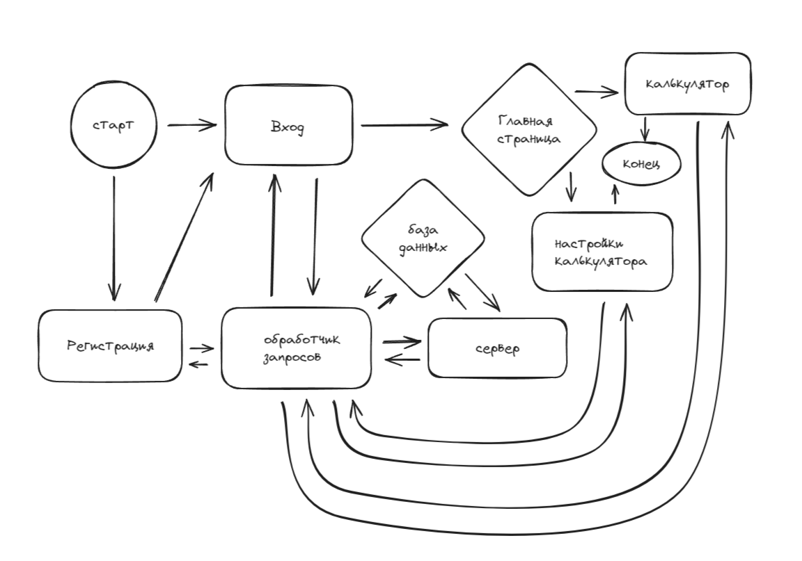

# CalculaterForYandex
<h1 align="center">Привет, я Илья 
</h1>
это финальная задача 3 спринта для яндекса

чтобы запустить калькулятор, нужно открыть файл m.exe
если система запрашивает разрешение, то смело разрешаем

после запуска нужно в браузере зайти на http://localhost:8888/register.html

в вкладке калькулятор вам нужно ввести выражение с +, -, * или /, все остальные знаки НЕ РАБОТАЮТ. Скобки ставить можно.

в вкладке настройка калькулятора вы можете настроись скорость выполнения примеров

пример использования:

https://github.com/Shvalya/CalculaterForYandex/zapis.mp4

Если exe не работает, то надо забилдить, извини но какая у тебя ПО я не знаю
тг: @ilia_leonid

Схема работы:

